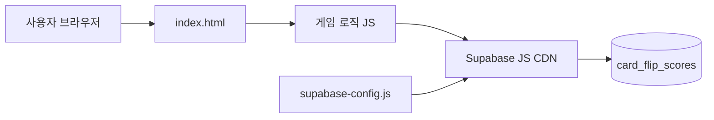

# 카드 뒤집기 게임 — Sequential Thinking 개발 계획

> **기술:** HTML + CSS + JavaScript (빌드 없음)  
> **DB:** Supabase `card_flip_scores`  
> **폴더:** `mcp 카드게임`

---

## Thought 1 / 6 — 목표 정의

**무엇을 만들 것인가?**

- 4×4 카드 짝 맞추기 게임 (8쌍)
- 클리어 시 **Supabase에 점수 저장**
- 시작 시 **닉네임(user_id)** 입력
- **가장 간단한 웹**: HTML 1~2개 파일, CDN으로 Supabase JS만 추가

**하지 않을 것**

- React, Vite, npm 빌드
- Canvas (선택: CSS `transform` 뒤집기가 더 단순)
- 서버(Python/Node) — 정적 파일만

---

## Thought 2 / 6 — DB 매핑 (Supabase)

**테이블:** `card_flip_scores` (이미 생성됨)

| 컬럼 | 게임에서 넣을 값 |
|------|------------------|
| `user_id` | 플레이어 닉네임 (varchar) |
| `score` | 계산 점수 (int, 높을수록 좋음) |
| `play_time` | INSERT 시 DB 기본값 `now()` (자동) |

**점수 공식 (안)**

```
score = max(0, 10000 - moves × 100 - elapsedSeconds × 10)
```

- 시도 적을수록, 시간 짧을수록 점수 ↑
- 책/테스트 데이터(8500)와 비슷한 범위

**저장 시점:** 8쌍 전부 맞춘 순간 1회 INSERT

**RLS:** SELECT/INSERT 공개 정책 이미 적용 → **anon key**만으로 브라우저에서 저장 가능

---

## Thought 3 / 6 — 파일 구조

```
mcp 카드게임/
├── index.html      # 게임 UI + 로직 + 스타일 (또는 css 분리)
├── supabase-config.js   # URL, anon key (대시보드에서 복사)
├── 개발계획.md     # 이 문서
└── 카드게임.bat    # 브라우저로 index.html 열기
```

**선택:** `mcp 연습/card-flip-game.html` Canvas 버전 코드 참고 가능 → 이 프로젝트는 **div + CSS** 로 더 단순하게 새로 작성

---

## Thought 4 / 6 — 화면·기능 설계

### 화면 구성

1. **시작 화면** — 닉네임 입력 + [게임 시작]
2. **게임 화면** — HUD(시도, 시간) + 4×4 카드 그리드
3. **클리어 화면** — 점수, Supabase 저장 결과 + [다시 하기]
4. **랭킹 영역** (하단) — Supabase SELECT 상위 10명

### 게임 로직

```
카드 16장 셔uffle
→ 클릭 2장 뒤집기
→ 같으면 matched 유지 / 다르면 0.7초 후 다시 뒤집기
→ moves++, 8쌍 완료 시 score 계산 → Supabase INSERT
```

### Supabase 연동 (브라우저)

```javascript
import { createClient } from 'https://cdn.jsdelivr.net/npm/@supabase/supabase-js/+esm'

// INSERT
await supabase.from('card_flip_scores').insert({
  user_id: nickname,
  score: calculatedScore
})

// SELECT 랭킹
await supabase.from('card_flip_scores')
  .select('user_id, score, play_time')
  .order('score', { ascending: false })
  .limit(10)
```

---

## Thought 5 / 6 — 개발 순서 (단계)

| 단계 | 작업 | 완료 기준 |
|------|------|-----------|
| **1** | `index.html` 뼈대 + CSS 카드 뒤집기 | 카드 클릭·매칭 동작 |
| **2** | 타이머, moves, 클리어 판정 | 8쌍 맞추면 완료 메시지 |
| **3** | `supabase-config.js` + INSERT | 클리어 시 DB에 1행 추가 |
| **4** | SELECT 랭킹 UI | Table Editor와 동일 데이터 표시 |
| **5** | `카드게임.bat` + 마무리 | 더블클릭 실행 |

**필요 설정 (1회)**

- Supabase 대시보드 → Settings → API  
  - Project URL: `https://grduuxyabkjweqlgszib.supabase.co`  
  - **anon public key** → `supabase-config.js`에 입력

---

## Thought 6 / 6 — 리스크·검증

| 리스크 | 대응 |
|--------|------|
| anon key 노출 | 공개 키는 프론트 사용 OK, RLS로 INSERT만 허용 |
| CORS | Supabase REST는 브라우저에서 기본 허용 |
| key 없음 | config 파일 git 제외 또는 placeholder |
| Canvas vs div | **div + CSS** 채택 (가장 단순) |

**검증 체크리스트**

- [ ] 로컬에서 게임 클리어
- [ ] Supabase Table Editor에 새 row
- [ ] 랭킹에 방금 점수 표시
- [ ] 새로고침 후에도 랭킹 유지

---

## 아키텍처 다이어그램



---

## 예상 소요

| 단계 | 시간 |
|------|------|
| 1~2 게임 코어 | 1~2시간 |
| 3~4 Supabase | 30분~1시간 |
| **합계** | **약 2~3시간** |

---

## 다음 명령 (구현 시작 시)

> "개발 계획대로 mcp 카드게임 폴더에 만들어줘"

또는 단계별:

> "1단계만 먼저 만들어줘" → 게임만  
> "Supabase 연동까지 해줘" → INSERT + 랭킹
